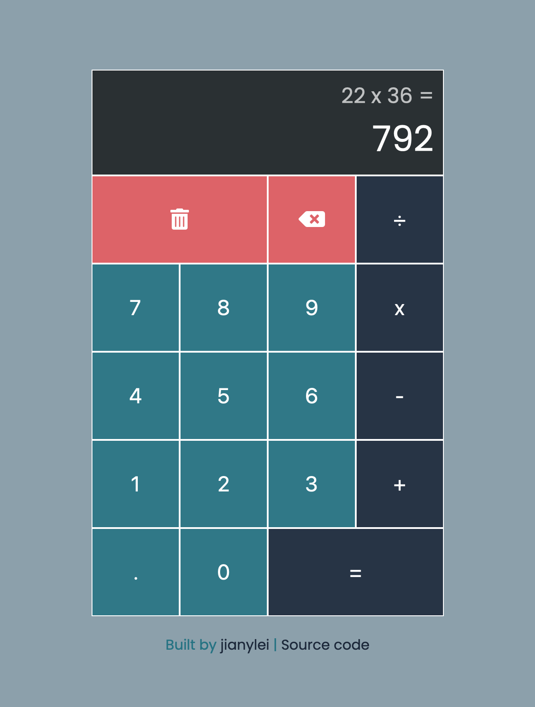

# calculator

Calculator app built using javascript, html, and DOM manipulation.

Current functionalities:<ul>
  <li>addition</li>
  <li>subtraction</li>
  <li>multiplication</li>
  <li>division</li>
  <li>keyboard support</li>
</ul>
<a href="https://jianylei.github.io/calculator/">Live App</a>

    

